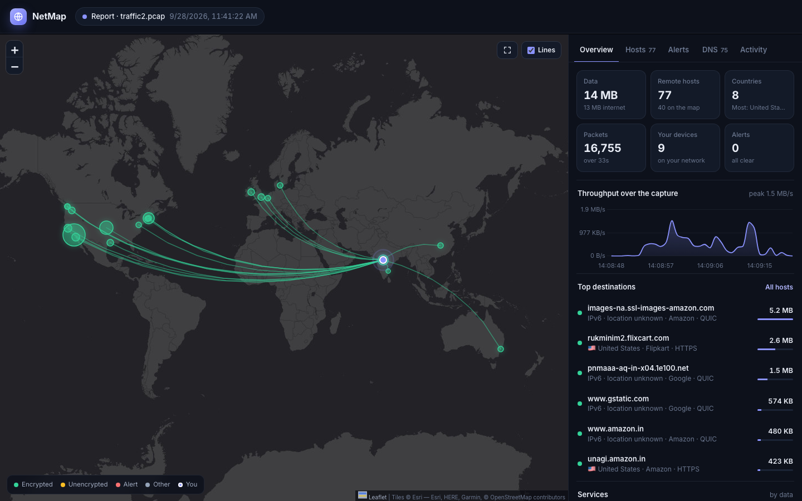

# NetMap – Network Tracking with Wireshark & Maps

See **where your internet traffic goes**. NetMap puts every server your computer talks to on a world map, with its real name (youtube.com, amazon.in…), how much data went there, whether the connection is encrypted, and alerts for anything suspicious.



## Start in one step

| Your computer | Do this |
|---|---|
| **macOS** | Double-click **`NetMap.command`**. The first time, macOS may block it: right-click it → **Open** → **Open**. |
| **Windows** | Double-click **`start.bat`**. |
| **Linux** | Run `./run_dashboard.sh` in a terminal. |

The first launch sets everything up automatically, which takes about a minute. After that NetMap opens in your browser at **http://127.0.0.1:5050**. Keep the small terminal window open while you use it.

> **Only requirement:** Python 3.9 or newer. macOS usually has it already; if not, run `xcode-select --install`. On Windows, get it from [python.org](https://www.python.org/downloads/) and tick *"Add python.exe to PATH"*.

The welcome screen gives you three choices:

- **Watch live:** see this computer's connections as they happen. On macOS and Linux you'll get the normal system password prompt once; no terminal or `sudo` needed. On Windows, install [Npcap](https://npcap.com) (it comes with Wireshark).
- **Open a capture:** drag any Wireshark `.pcap` / `.pcapng` file onto the page. No password needed.
- **Try the sample:** explore the included `traffic2.pcap`, 30 seconds of real browsing.

Everything is analyzed locally. Nothing is uploaded anywhere.

## What you get

- 🌍 **Map:** servers grouped by location and sized by data, with lines from you. Colours show status: green = encrypted, yellow = unencrypted, red = alert, grey = other. Lines animate while you're watching live.
- 🏷️ **Real names:** taken from DNS lookups, the site name in HTTPS handshakes (SNI), HTTP headers and reverse DNS, plus the company behind each one (Google, Amazon, Meta…).
- 🔎 **Host details:** click any host for its location, data sent and received, ports, which of your devices talked to it, a plain-English explanation, and a "who owns this IP" lookup.
- 🛡️ **Security alerts:** port scans, backdoor/botnet ports (4444, 31337, 6667…), Telnet/SMB/RDP to the internet, unencrypted HTTP/FTP/email, random-looking (malware-style) domain names, and large uploads.
- 📊 **Panels:**
  - **Overview:** throughput, top destinations, services, countries and your devices.
  - **Hosts:** searchable and filterable list.
  - **Alerts:** the security alerts above.
  - **DNS:** every name that was looked up, including the trackers.
  - **Activity:** a live feed of new connections.
- 📤 **Export:** a shareable **offline HTML report**, **KML** for Google My Maps / Google Earth, **CSV**, a text summary or JSON.

## Command line (optional)

```bash
.venv/bin/python main.py capture.pcapng
```

This writes `capture_report.html`, `capture_map.kml`, `capture_hosts.csv`, `capture_statistics.txt` and `capture_data.json` next to the capture.

Useful options (they work with `main.py`, `app.py` and the launchers):

| Option | Meaning |
|---|---|
| `--pcap FILE` | Open this capture when the dashboard starts |
| `--my-ip 1.2.3.4` | Your public IP when the capture was taken. By default it's auto-detected, which is right for captures made on your current network. |
| `--home 12.97,77.59` | Put "you" at an exact latitude/longitude |
| `--protocol tcp\|udp\|icmp` | Only analyze one protocol (CLI) |
| `--no-rdns` / `--no-ip-lookup` | Stay fully offline |
| `--host 0.0.0.0` | Let other devices on your network open the dashboard |
| `--sudo` | (launcher) Run everything as root instead of using the password prompt |

## Better locations and IPv6 (recommended)

The included `GeoLiteCity.dat` is old and **IPv4-only**, so IPv6 servers show "location unknown". For accurate, current locations with IPv6 support, drop a free City database in `.mmdb` format into this folder. NetMap picks it up automatically:

- [DB-IP City Lite](https://db-ip.com/db/download/ip-to-city-lite): free, no account (`dbip-city-lite-YYYY-MM.mmdb`)
- [MaxMind GeoLite2 City](https://dev.maxmind.com/geoip/geolite2-free-geolocation-data): free account (`GeoLite2-City.mmdb`)

## Capturing with Wireshark

1. Start Wireshark and double-click your active interface (Wi-Fi / Ethernet).
2. Browse normally for a minute, then press stop.
3. **File → Save As** → `.pcapng`.
4. Drop the file onto NetMap.

## Good to know

- A location is where an IP is registered or hosted. For big services that's usually a nearby CDN server, not the company's headquarters.
- Turn off VPNs while capturing, or everything will appear to go to the VPN server.
- Alerts are heuristics that point at things worth a look. They are not proof of an attack.

## Project layout

```
NetMap.command / start.bat / run_dashboard.sh   one-click launchers (auto setup)
app.py              dashboard server (live capture, file uploads, exports)
capture_helper.py   tiny packet sniffer started with admin rights via the password prompt
analyzer.py         core engine: parsing, hostnames, GeoIP, alerts, exporters
main.py             command-line analyzer
templates/, static/ dashboard UI (also used for the offline HTML report)
```
